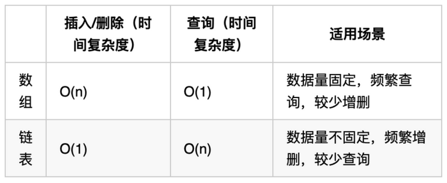

# 基础知识
链表是一种通过指针串联在一起的线性结构，每个节点由两部分组成，一个是数据域，一个是指针域（存放指向下一个节点的指针），最后一个节点的指针指向null(空指针的意思)。

链表的入口节点，也就是链表的头节点，称为head。

链表的类型：
- 单链表：基本定义就是单链表。
- 双链表：在单链表的基础上，增加一个指针域，一个指向后一个节点，一个指向前一个节点。既可以向前查询也可以向后查询。
- 循环链表：首尾相连，可以解决约瑟夫环的问题。

链表的存储方式：链表在内存中不是连续存放的，通过指针域的指针链接在内存中的各个节点。分配机制取决于操作系统的内存管理。

链表的定义：
```C++
//单链表
struct ListNode {
    int val;
    ListNode *next;
    ListNode(int x): val(x), next(null){}
}
```
C++默认生成一个构造函数,但是这个构造函数不会初始化任何成员变量。因此使用默认构造函数的话，在初始化时不能直接给变量赋值。
```
//默认构造函数
ListNode* node = new ListNode();
node->val = 5;

//自定义构造函数
ListNode* node = new ListNode(5);
```
链表的操作：删除、新增。

性能分析：



# 例题解析
## 移除链表元素
使用C/C++删除链表元素时，注意清理被移除节点的内存。

两种删除方式：
- 直接在原始链表上进行删除操作
  - 头节点：将头节点向后移动一位，并清理内存
  - 非头节点：使用前一个节点移除当前节点，并清理内存
- 设置一个虚拟头节点再进行删除操作：给链表添加一个虚拟头结点为新的头结点，此时删除头节点与非头节点操作相同，返回时注意返回`return dummyNode->next;`

## 两两交换链表中的节点
此题适用于添加一个头节点的情况，通过头节点能够更方便地确定下一组需要进行交换的两节点的位置。

## 删除链表的倒数第N个节点————双指针
双指针的经典应用，如果要删除倒数第n个节点，让fast移动n步，然后让fast和slow同时移动，直到fast指向链表末尾（指向最后一个节点的next,即null）。

## 链表相交
感觉类似于上一题的思想，快慢指针的间隔转化为两条链表长度的差值。

## 环形链表II——快慢指针
主要考察两知识点：
- 判断链表是否环：使用快慢指针法，分别定义 fast 和 slow 指针，从头结点出发，fast指针每次移动两个节点，slow指针每次移动一个节点，如果 fast 和 slow指针在途中相遇 ，说明这个链表有环。
- 如果有环，如何找到这个环的入口： fast指针走过的节点数 = slow指针走过的节点数 * 2。

假设从头结点到环形入口节点 的节点数为x。 环形入口节点到 fast指针与slow指针相遇节点 节点数为y。 从相遇节点 再到环形入口节点节点数为 z。
`(x + y) * 2 = x + y + n (y + z)`

意味着，从头结点出发一个指针，从相遇节点 也出发一个指针，这两个指针每次只走一个节点， 那么当这两个指针相遇的时候就是 环形入口的节点。


