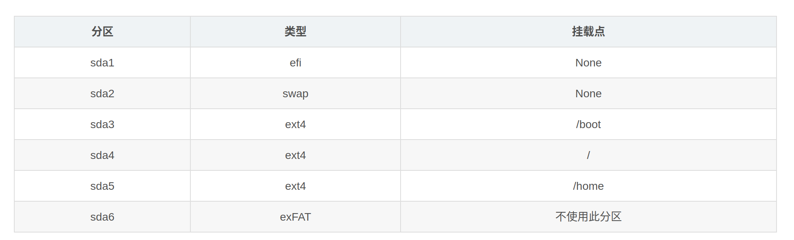

 > 参考资料：
 > 
> https://blog.csdn.net/2301_81212168/article/details/134896613 
 >
> https://blog.csdn.net/m0_64545111/article/details/136131918

# 工具准备
1. 用于制作启动盘的U盘（32G，推荐8GB以上）。
2. 用于安装系统的移动固体硬盘（1TB）。 
3. Rufus软件用于制作启动盘 。
4. DisGenius软件，用于磁盘分区。


# 制作系统启动盘
首先插入U盘，在[Ubuntu官网](https://cn.ubuntu.com/download/desktop)下载镜像.iso文件，我安装的Ubuntu22.04 LTS。使用Rufus将镜像文件写入U盘。

# 磁盘分区
插入硬盘，在DiskGenius软件中进行磁盘分区。首先需要将硬盘分区表类型转化为GUID格式，右键准备安装系统的硬盘，点击“转换分区表类型为GUID格式”。
然后根据参考资料中的[磁盘分区方法](https://blog.csdn.net/m0_64545111/article/details/136131918)进行分区。内存分区需要和你电脑配置的内存分区大小一致。

# 安装系统
将U盘和硬盘都插入电脑，按F2进入BIOS启动页面（不同电脑可能不一样），发现在启动项中没有参考资料中所说的“Linpus lite”或者“ubuntu”启动U盘标识，只有“EFI（硬盘名称）”。点击此启动项进入ubuntu系统安装。

安装时基本上根据自己的需要进行选择，在选择安装类型步骤时，一定要选择“其他选项”，进行分区挂载。注意要将安装启动引导器的设备选择为移动硬盘的EFI区。


完成之后点击“现在安装”，等待安装完成；全部安装完成后进入ubuntu系统界面。

# 将系统启动引导程序迁移到移动硬盘上
将启动引导程序迁移到移动硬盘上，就可以在电脑启动时进入硬盘的启动引导，而不是按F12进入BIOS进行系统启动选择。进入Ubuntu系统后，连接网络，打开终端输入下面的指令安装boot-repair软件：

```
sudo apt-add-repository ppa:yannubuntu/boot-repair
sudo apt update
sudo apt install boot-repair
```
安装完成后，输入命令运行该软件：
```aiignore
boot-repair
```
选择“Recommended repair”，等待程序运行完成即可。

# 后续问题
在以上步骤完成后，linux to go已基本完成。但是重新启动ubuntu会发现启动会卡在ubuntu启动页面，一直进不去桌面。其实是系统显卡驱动没有正确安装。
在启动选择ubuntu启动时，编辑ubuntu grub。在"quiet splash"后添加"nomodeset",意为可以告诉内核，系统启动过程中，暂时不运行图像驱动程序。但是在每次启动时都需要手动更改grub文件有些繁琐。
> https://blog.csdn.net/CaptainHailong/article/details/79765579
> 
> https://blog.csdn.net/dair6/article/details/121151562

因此可以在进入系统后编辑grub文件，在terminal中输入“sudo nano /etc/default/grub”，同样在splash后面加上nomodeset。:wq保存后，输入"sudo update-grub"。之后系统就可以正常启动了。

但此时发现，ubuntu系统亮度等无法调节，设置中系统显卡信息显示为llvmpipe llvm 12.0.0 256 bits,本机的显卡并未被识别。按照网上大多数教程在软件与更新——》附加驱动中查找驱动，但是附加驱动中可安装选项为空。

> https://www.intel.cn/content/www/cn/zh/support/articles/000005520/graphics.html

上方链接详细讲述了安装intel显卡的方法（可能网上教程更适用于nivida显卡？
